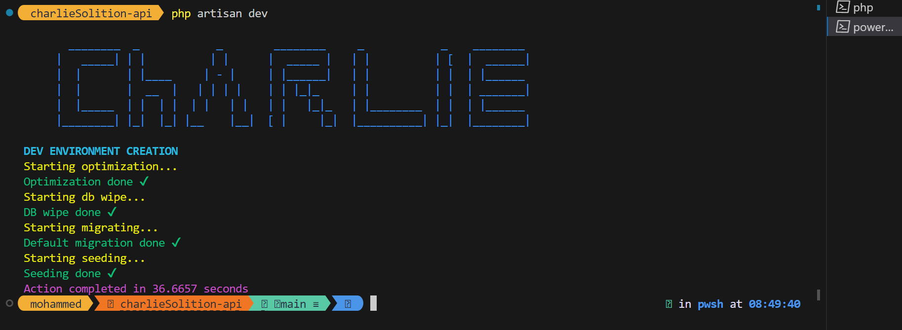

# CharlieSolution
```
Charlie

```

## installation

install your dependencies :

to have your `/vendor` directory :
```
composer install
```
then the `/node_modules` :
```
npm install
```
don't forget to make your `.env` file with your app key and your database

## reset database

***the parameters are not required***, erase the database, then recreate it and run the migration, add ```--seed``` to seed
```
php artisan db:reset --seed
```

## Set up dev environment

***the parameters are not required***, automatically run `artisan optimize`, `artisan migrate:fresh --seed`, and generate multiple users for testing :

``` shell
php artisan dev
```

![la commande dev]


